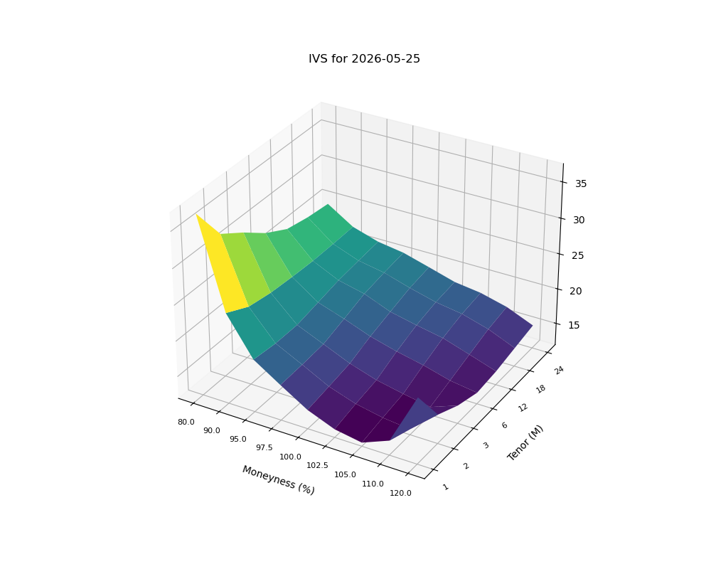
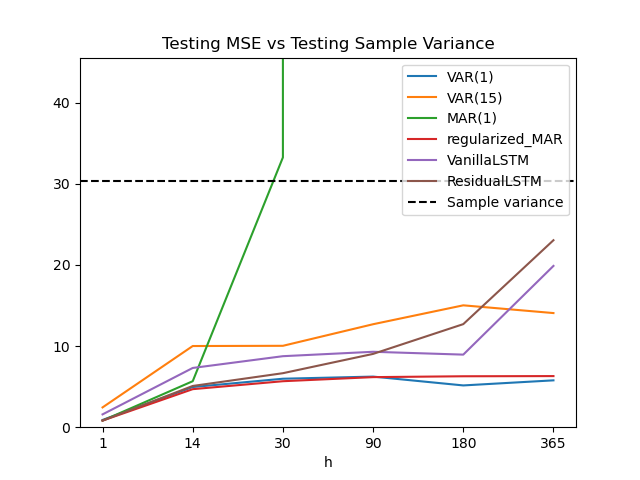
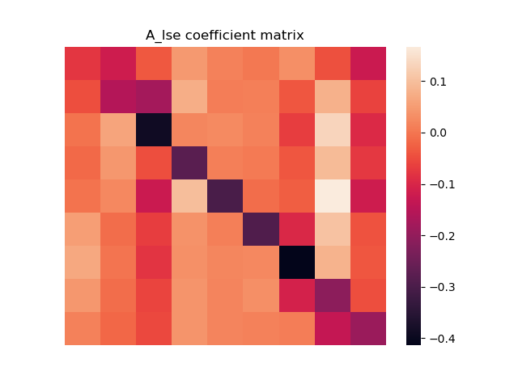
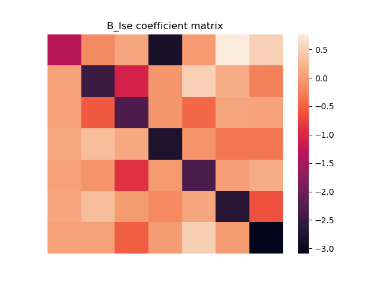
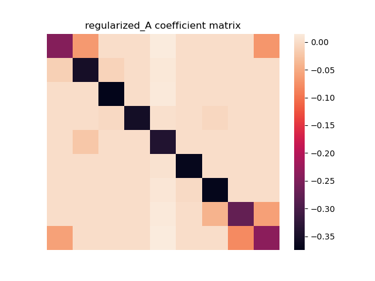
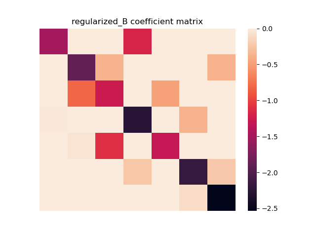
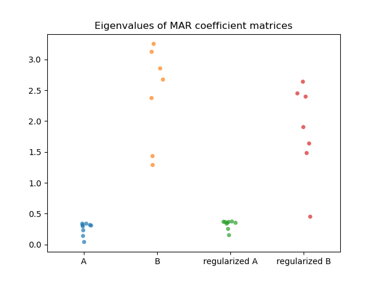

# Regularized MAR and Residual LSTM in Forecasting Implied Volatility Surfaces

This project compares the predictive performance of deep-learning architectures LSTM and LSTM with residual connections against econometric baselines Vector Autoregressive (VAR), Matrix Autoregressive (MAR), and MAR with regularization in forecasting Implied Volatility (IV) surfaces.

The traditional VAR model requires flattening the IV matrix into a vector, which exponentially increases the number of parameters and destroys the row-column relationship. By taking the bilinear form, the MAR model simultaneously handles both of these problems and can further improve with regularization. ElasticNet with 95% Lasso is chosen in favor of flexibility.

While these time-series econometric models assumes linearity, sequential deep learning models captures non-linear relationships. Two LSTM architectures are implemented without and with residual connections, called Vanilla LSTM and Residual LSTM respectively. Residual connections force hidden neurons to predict the changes of IV rather than IV itself, which is useful to capture the random walk characteristics of financial data.


## Methodology

### Data collection

- Source: Bloomberg
- Time period: 4/1/2016 - 5/25/2026
- Moneyness (S/K): 80%, 90%, 95%, 97.5%, 100%, 102.5%, 105%, 110%, 120%
- Tenor (Time to maturity): 1M, 2M, 3M, 6M, 12M, 18M, 24M



### Vector autoregressive model (VAR)

Let $X_t \in \mathbb{R}^{m \times n}$ represent the IV matrix at time $t$.

VAR(1):

$$\text{vec}(X_t) = \Phi\text{vec}(X_{t-1}) + e_t$$

where $\text{vec}(.)$ is the vectorization of a matrix by stacking its columns.

- Fail to capture relationship between rows and columns
- Number of parameters: $O(m^2n^2)$

### Matrix autoregressive model (MAR)

MAR(1):

$$X_t = A X_{t-1} B^\top + E_t$$

- Preserve the matrix structure
- Number of parameters: $O(m^2+n^2)$

Vectorized representation of MAR(1):

$$\text{vec}(X_t) = (B \otimes A)\text{vec}(X_{t-1}) + \text{vec}(E_t)$$

where $\otimes$ denotes the Kronecker product.

### MAR estimation (1): projection

Project an estimator of the VAR coefficient matrix, denoted as $\hat{\Phi}$, onto the space of Kronecker products under the Frobenius norm:

$$(\hat{A}_1, \hat{B}_1) = \arg\min_{A,B} \|\hat{\Phi} - B \otimes A\|_F^2$$

An explicit solution exists, obtained through a singular value decomposition (SVD) of a re-arrangement version of $\hat{\Phi}$ (Van Loan, 2000).

The set of entries of $B \otimes A$ is the same as the set of entries of $\text{vec}(A)\text{vec}(B)'$.

Define a re-arrangement operator $\mathcal{G} : \mathbb{R}^{mn \times mn} \rightarrow \mathbb{R}^{m^2 \times n^2}$:

$$\mathcal{G}(B \otimes A) = \text{vec}(A)\text{vec}(B)'$$

Given $\|\mathcal{G}(\boldsymbol{C})\|_F = \|\boldsymbol{C}\|_F$ and $\mathcal{G}$ is linear:

$$\begin{aligned}
\min_{\boldsymbol{A},\boldsymbol{B}} \|\hat{\Phi} - \boldsymbol{B} \otimes \boldsymbol{A}\|_F^2
&= \min_{\boldsymbol{A},\boldsymbol{B}} \|\mathcal{G}(\hat{\Phi}) - \mathcal{G}(\boldsymbol{B} \otimes \boldsymbol{A})\|_F^2 \\
&= \min_{\boldsymbol{A},\boldsymbol{B}} \|\mathcal{G}(\hat{\Phi}) - \text{vec}(\boldsymbol{A})\text{vec}(\boldsymbol{B})'\|_F^2 \\
&= \min_{\boldsymbol{A},\boldsymbol{B}} \|\tilde{\Phi} - \text{vec}(\boldsymbol{A})\text{vec}(\boldsymbol{B})'\|_F^2
\end{aligned}$$

where $\tilde{\Phi} = \mathcal{G}(\hat{\Phi})$ is the re-arranged $\hat{\Phi}$.

Then:

$$\text{vec}(\hat{\boldsymbol{A}})\text{vec}(\hat{\boldsymbol{B}})' = d_1 \boldsymbol{u}_1 \boldsymbol{v}_1'$$

where $d_1$ is the largest singular value of $\tilde{\Phi}$, and $u_1$, $v_1$ are the corresponding first left and right singular vectors.

By converting the vectors into matrices, we obtain the projection estimators (PROJ) of $A$ and $B$, denoted by $\hat{A}_1$ and $\hat{B}_1$, with the normalization that $\|\hat{A}_1\|_F = 1$.

### MAR estimation (2): iterated least square

Assume entries of $E_t$ are i.i.d. with mean zero and constant variance:

$$\min_{A,B} \sum_t \|X_t - A X_{t-1} B'\|_F^2$$

FOCs:

$$\sum_t A X_{t-1} B' B X_{t-1}' - \sum_t X_t B X_{t-1}' = 0$$

$$\sum_t B X_{t-1}' A' A X_{t-1} - \sum_t X_t' A X_{t-1} = 0$$

With probability one, the problem has a unique global minimum, and finitely many local minima.

Using the $\hat{A}_1$ and $\hat{B}_1$ (PROJ) as the starting values, iteratively update one matrix, $\hat{A}$ or $\hat{B}$, while fixing the other:

$$B \leftarrow \left(\sum_t X_t' A X_{t-1}\right) \left(\sum_t X_{t-1}' A' A X_{t-1}\right)^{-1}$$

$$A \leftarrow \left(\sum_t X_t B X_{t-1}'\right) \left(\sum_t X_{t-1} B' B X_{t-1}'\right)^{-1}$$

to obtain $\hat{A}_2$ and $\hat{B}_2$, referred to as LSE.

### Regularized MAR with ElasticNet

Rewrite MAR into:

$$\text{vec}(Y_t) = ((B Y_{t-1}') \otimes I_m) \text{vec}(A) + \text{vec}(E_t)$$

$$\text{vec}(Y_t') = ((A Y_{t-1}) \otimes I_n) \text{vec}(B) + \text{vec}(E_t')$$

Denote:

$$\begin{aligned}
Z_{t-1} &= (B Y_{t-1}') \otimes I_m, \quad \widehat{Z}_{t-1} = (\widehat{B} Y_{t-1}') \otimes I_m \\
Z_{t-1}^* &= (A Y_{t-1}) \otimes I_n, \quad \widehat{Z}_{t-1}^* = (\widehat{A} Y_{t-1}) \otimes I_n
\end{aligned}$$

Using $\widehat{A}_2$ and $\widehat{B}_2$ (LSE) as the starting values, iteratively solve the optimization to update one matrix, $\widehat{A}$ or $\widehat{B}$, while fixing the other:

$$\widehat{\alpha} = \arg\min_{\alpha \in \mathbb{R}^{m^2}} \{ \frac{1}{T} \sum_{t=2}^T \| \mathbf{y}_t - \widehat{\mathbf{Z}}_{t-1} \alpha \|_2^2 + \lambda_A ( 0.95 \|\alpha\|_1 + 0.05 \|\alpha\|_2^2 ) \}$$

$$\widehat{\beta} = \arg\min_{\beta \in \mathbb{R}^{n^2}} \{ \frac{1}{T} \sum_{t=2}^T \| \mathbf{y}_t^* - \widehat{\mathbf{Z}}_{t-1}^* \beta \|_2^2 + \lambda_B ( 0.95 \|\beta\|_1 + 0.05 \|\beta\|_2^2 ) \}$$

The estimated coefficients are consistent under the condition that $\max(m,n)mn/T \rightarrow 0$, and $A$ and $B$ have a finite number of non-zero entries.

### LSTM

- Vanilla LSTM: $\hat{y}_{t} = W_{FC} h_{t-1}$
- Residual LSTM: $\hat{y}_{t} = y_{t-1} + W_{FC} h_{t-1}$

```text
Time:        t=1            t=2                       t=N
              │              │                         │
Input:       y_1            y_2        . . .          y_N  ═══════════════════╗
              │              │                         │                      ║
              ▼              ▼                         ▼                      ║
           ┌──────┐       ┌──────┐                  ┌──────┐                  ║
Layer 1:   │ LSTM │ ────► │ LSTM │ ──► . . . ────►  │ LSTM │                  ║
           └──────┘       └──────┘                  └──────┘                  ║
              │              │                         │                      ║
              ▼              ▼                         ▼                      ║
           ┌──────┐       ┌──────┐                  ┌──────┐                  ║
Layer 2:   │ LSTM │ ────► │ LSTM │ ──► . . . ────►  │ LSTM │                  ║
           └──────┘       └──────┘                  └──────┘                  ║
              │              │                         │                      ║
              ▼              ▼                         ▼                      ║
              .              .                         .                      ║
              .              .                         .                      ║
              ▼              ▼                         ▼                      ║
           ┌──────┐       ┌──────┐                  ┌──────┐                  ║
Layer K:   │ LSTM │ ────► │ LSTM │ ──► . . . ────►  │ LSTM │                  ║
           └──────┘       └──────┘                  └──────┘                  ║
                                                       │                      ║
                                                       ▼                      ║
                                                  ( Dropout )                 ║
                                                       │                      ║
                                                       ▼                      ║
                                                  [ FC Layer ]                ║
                                                       │                      ║
                                                       ▼                      ║
                                                     ( + ) ◄══════════════════╝
                                                       │
                                                       ▼
                                                     y_hat

```


## Findings

### Out-of-sample MSE



Residual LSTM and regularized MAR achieved the best, almost equal test MSE for 1-day forecast horizon. As the horizon increases, regularized MAR and VAR(1) remains more stable while unregularized MAR explodes after 14 days.

### MAR

The off-diagonal entries of MAR's matrix coefficients are close to 0, turning them to scaled identity matrices. 




This pattern becomes clearer after regularization.




Eigenvalues of matrices A are bounded by 0.5 while these of matrices B grow up to 3. Regularization helps reduce their weights.




## Project structure

```text
.
├── README.md
├── config/
│   └── environment.yml
├── data/
│   ├── raw/
│   ├── processed/
│   └── result/
├── asset/
│   ├── figure/
│   ├── reference/
│   └── report.typ
├── notebook/
└── src/
```

## How to run locally

### 1) Set up a Conda environment

```bash
conda env create -f config/environment.yml -p ./.env
conda activate ./.env
```

### 2) Run the full pipeline

```bash
python src/run.py
```

## References

Jiang, H., Shen, B., Li, Y., & Gao, Z. (2024). Regularized estimation of high-dimensional matrix-variate autoregressive models

Chen, R., Xiao, H., & Yang, D. (2018). Autoregressive models for matrix-valued time series
