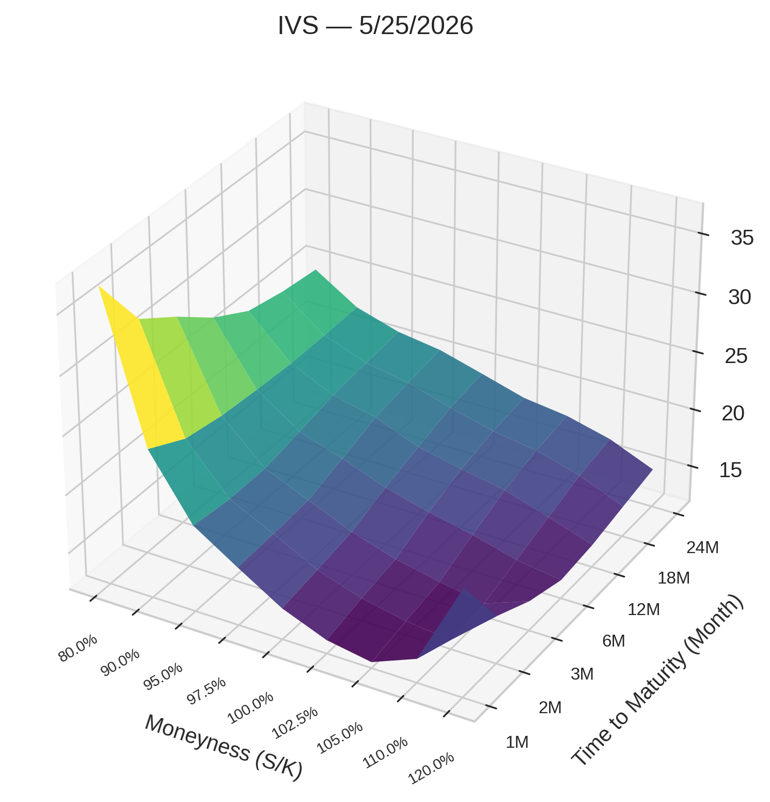
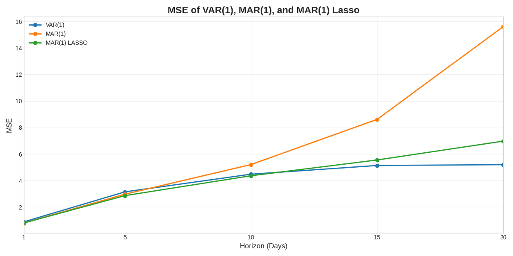
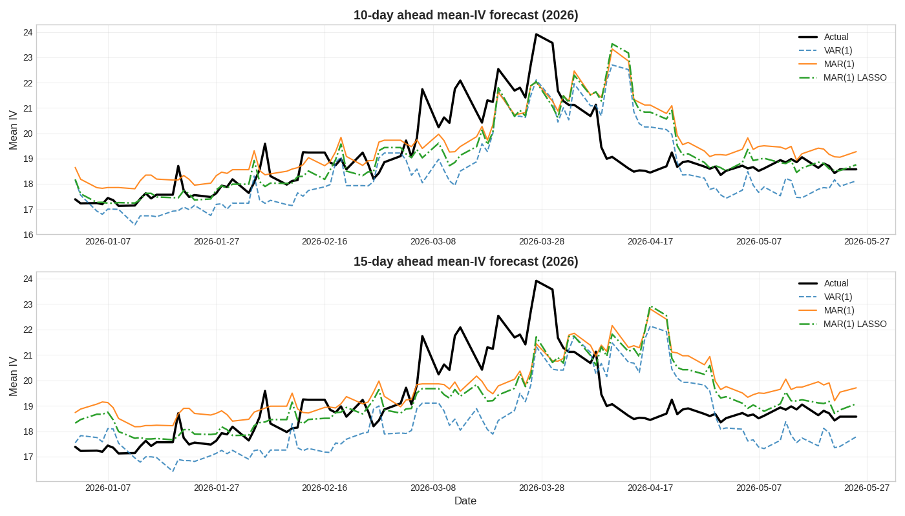

---

marp: true
theme: gaia
paginate: true
style: |
  section.table-slide {
    display: flex;
    flex-direction: column;
  }
  section.table-slide .table-middle {
    flex: 1;
    display: flex;
    align-items: center;
    justify-content: center;
  }
  section.table-slide .table-middle table {
    margin: 0;
  }
  section.table-slide .table-footnote {
    flex-shrink: 0;
    margin-top: 0.5em;
    font-size: 0.8em;
    text-align: left;
    opacity: 0.85;
  }
  section.image-slide {
    display: flex;
    flex-direction: column;
  }
  section.image-slide h2 {
    flex-shrink: 0;
    margin-bottom: 0;
  }
  section.image-slide .image-middle {
    flex: 1;
    display: flex;
    align-items: center;
    justify-content: center;
    width: 100%;
    min-height: 0;
  }
  section.image-slide .image-middle p {
    margin: 0;
    display: flex;
    align-items: center;
    justify-content: center;
    width: 100%;
    height: 100%;
  }
  section.image-slide .image-middle img {
    display: block;
    margin: 0 auto;
  }
  section.bs-slide .bs-legend {
    display: flex;
    justify-content: space-evenly;
    gap: 0.5rem;
    padding: 0 2rem;
  }
  section.bs-slide .bs-legend > div {
    flex: 0 1 auto;
    min-width: 8em;
  }

---

<!-- _class: lead -->
# Regularized MAR and LSTM
# in forecasting IV surfaces

---

### Options Pricing Overview

- Option: financial instruments that give the owner the right, but not the obligation, to buy or sell an underlying asset at a strike price
  - Strike price
  - Time to maturity

- Two types: call and put options

- European options: can only be exercised at expiration

---

<!-- _class: bs-slide -->

### Black-Scholes's model

$$
C = S_0 N(d_1) - K e^{-rT} N(d_2)
$$

$$
P = K e^{-rT} N(-d_2) - S_0N(-d_1)
$$

where

$$
d_1 = \frac{\ln(S_0/K) + (r + \tfrac{1}{2}\sigma^2)T}{\sigma\sqrt{T}},
\qquad
d_2 = d_1 - \sigma\sqrt{T}
$$

and

<div class="bs-legend">

<div>
S<sub></sub>: stock price <br>
K: strike price
</div>

<div>
r: risk-free interest rate <br>
T: time to maturity <br>
</div>

<div>
&sigma;: volatility
</div>

</div>

---

### Black Scholes Model

- Assumptions:
1. The underlying stock does not pay a dividend and never will
2. The option must be European-style
3. Financial markets are efficient
4. No commissions are charged on the trade
5. Interest rates remain constant
6. The underlying stock returns are log-normally distributed

---

### Data Collection

<div style="display: flex; align-items: top; gap: 40px;">

  <div style="flex: 1;">
    <br>
    <strong>Source:</strong><br>Bloomberg<br>
    <strong>Time period:</strong><br>4/1/2016 - 5/25/2026<br>
    <strong>Moneyness (S/K):</strong><br>80%, 90%, 95%, 97.5%, 100%, 102.5%, 105%, 110%, 120%<br>
    <strong>Time to maturity:</strong><br>1M, 2M, 3M 6M, 12M, 18M, 24M<br>
  </div>

  <div style="flex: 1;">
    
  </div>

</div>

---

### Vector Autoregressive Model (VAR)

Let $X_t \in \mathbb{R}^{m \times n}$ represent the IV matrix at time $t$

VAR(1):

$$
\text{vec}(X_t) = \Phi\text{vec}(X_{t-1}) + e_t
$$

*where $vec(.)$ is the vectorization of a matrix by stacking its columns*

- Fail to capture relationship between rows and columns
- Number of parameters: $O(m^2n^2)$

---

### Matrix Autoregressive Model (MAR) <span style="font-weight: normal; font-size: 65%; font-style: italic;">(Chen et al., 2020)</span>

MAR(1):
$$
X_t = A X_{t-1} B^\top + E_t
$$

- Preserve the matrix structure
- Number of parameters: $O(m^2+n^2)$

Vectorized representation of MAR(1): 

$$\text{vec}(X_t) = (B \otimes A)\text{vec}(X_{t-1}) + \text{vec}(E_t)$$
*where $\otimes$ denotes the matrix Kronecker product*

---

### MAR Estimation (1): Projection

Project $\hat{\Phi}$ onto the space of Kronecker products under the Frobenius norm:
  $$(\hat{A}_1, \hat{B}_1) = \arg\min_{A,B} \|\hat{\Phi} - B \otimes A\|_F^2$$
*An explicit solution exists, obtained through a singular value decomposition (SVD) of a re-arrangement version of ${\Phi}$ (Van Loan, 2000)* 

*The set of entries of $B \otimes A$ is the same as the set of entries of $\text{vec}(A)\text{vec}(B)'$*

---

Define a re-arrangement operator $\mathcal{G} : \mathbb{R}^{mn \times mn} \rightarrow \mathbb{R}^{m^2 \times n^2}$
$$
\mathcal{G}(B \otimes A) = \text{vec}(A)\text{vec}(B)'
$$

Given $\|\mathcal{G}(\boldsymbol{C})\|_F = \|\boldsymbol{C}\|_F$ and $\mathcal{G}$ is linear

$$
\begin{aligned}
\min_{\boldsymbol{A},\boldsymbol{B}} \|\hat{\Phi} - \boldsymbol{B} \otimes \boldsymbol{A}\|_F^2$

&= \min_{\boldsymbol{A},\boldsymbol{B}} \|\mathcal{G}(\hat{\Phi}) - \mathcal{G}(\boldsymbol{B} \otimes \boldsymbol{A})\|_F^2

\\ &= \min_{\boldsymbol{A},\boldsymbol{B}} \|\mathcal{G}(\hat{\Phi}) - \text{vec}(\boldsymbol{A})\text{vec}(\boldsymbol{B})'\|_F^2 \\

&= \min_{\boldsymbol{A},\boldsymbol{B}} \|\tilde{\Phi} - \text{vec}(\boldsymbol{A})\text{vec}(\boldsymbol{B})'\|_F^2,
\end{aligned}
$$

*where $\tilde{\Phi} = \mathcal{G}(\hat{\Phi})$ is the re-arranged $\hat{\Phi}$*

---

Then,
$$
\text{vec}(\hat{\boldsymbol{A}})\text{vec}(\hat{\boldsymbol{B}})' = d_1 \boldsymbol{u}_1 \boldsymbol{v}_1',
$$

*where $d_1$ is the largest singular value of $\tilde{\Phi}$, and $u_1$, $v_1$ are the corresponding first left and right singular vectors*

By converting the vectors into matrices, we obtain the *projection estimators (PROJ)* of $A$ and $B$, denoted by $\hat{A}_1$ and $\hat{B}_1$, with the normalization that $\|\hat{A}_1\|_F = 1$, refered

---

### MAR Estimation (2): Iterated least square

Assume entries of $E_t$ are i.i.d. with mean zero and constant variance:
  $$\min_{A,B} \sum_t \|X_t - A X_{t-1} B'\|_F^2$$

FOCs:
  $$\sum_t A X_{t-1} B' B X_{t-1}' - \sum_t X_t B X_{t-1}' = 0$$
  $$\sum_t B X_{t-1}' A' A X_{t-1} - \sum_t X_t' A X_{t-1} = 0$$

---

With probability one, the problem has a unique global minimum, and finitely many local minima

Using the $\hat{A}_1$ and $\hat{B}_1$ as the starting values, iteratively update one matrix, $\hat{A}$ or $\hat{B}$, while fixing the other
  $$B \leftarrow \left(\sum_t X_t' A X_{t-1}\right) \left(\sum_t X_{t-1}' A' A X_{t-1}\right)^{-1}$$
  $$A \leftarrow \left(\sum_t X_t B X_{t-1}'\right) \left(\sum_t X_{t-1} B' B X_{t-1}'\right)^{-1}$$

to obtain $\hat{A}_2$ and $\hat{B}_2$, refered as *LSE*

---

Split data: 80% old for train and 20% new for test
```
n_obs = len(Y_var)
split_idx = int(n_obs * 0.8)
Y_train, Y_test = Y_var.iloc[:split_idx], Y_var.iloc[split_idx:]
```
Fit VAR(1)
```
var1_model = VAR(Y_train)
var1_res = var1_model.fit(1)
```
- The coefficient matrix of VAR(1) is a 63x63 matrix (3969 parameters)

---

Fit VAR(p)
```
varp_model = VAR(Y_train)
varp_aic_res = varp_model.fit(maxlags=15, ic='aic') # p is selected by AIC
varp_bic_res = varp_model.fit(maxlags=15, ic='bic') # p is selected by BIC
```
- Optimal p selected by AIC: 15;
- Optimal p selected by BIC: 1
*BIC imposes a greater penalty on complexity*
$$\text{AIC} = \ln\left(\frac{\text{SSR}}{T}\right) + (p+1)\frac{2}{T},
\qquad
\text{BIC} = \ln\left(\frac{\text{SSR}}{T}\right) + (p+1)\frac{\ln(T)}{T}$$

Fit MAR(1): converged after 355 iterations

---

### Regularized MAR with LASSO <span style="font-weight: normal; font-size: 65%; font-style: italic;">(Jiang et al., 2024)</span>

Rewrite MAR into

$$
\text{vec}(Y_t) = ((B Y_{t-1}') \otimes I_m) \text{vec}(A) + \text{vec}(E_t)
$$
$$
\text{vec}(Y_t') = ((A Y_{t-1}) \otimes I_n) \text{vec}(B) + \text{vec}(E_t')
$$

Denote
$$
\begin{aligned}
Z_{t-1} &= (B Y_{t-1}') \otimes I_m, \quad \widehat{Z}_{t-1} = (\widehat{B} Y_{t-1}') \otimes I_m \\
Z_{t-1}^* &= (A Y_{t-1}) \otimes I_n, \quad \widehat{Z}_{t-1}^* = (\widehat{A} Y_{t-1}) \otimes I_n
\end{aligned}
$$

---

Using $\widehat{A}_2$ and $\widehat{B}_2$ as the starting values, iteratively solve the optimization to to update one matrix, $\widehat{A}$ or $\widehat{B}$, while fixing the other
$$
\widehat{\alpha} = \arg\min_{\alpha \in \mathbb{R}^{m^2}} \left\{ \frac{1}{T} \sum_{t=2}^T \| \mathbf{y}_t - \widehat{\mathbf{Z}}_{t-1} \alpha \|_2^2 + \lambda_{1,T} \|\alpha\|_1 \right\} \tag{1}
$$

$$
\widehat{\beta} = \arg\min_{\beta \in \mathbb{R}^{n^2}} \left\{ \frac{1}{T} \sum_{t=2}^T \| \mathbf{y}_t^* - \widehat{\mathbf{Z}}_{t-1}^* \beta \|_2^2 + \lambda_{2,T} \|\beta\|_1 \right\} \tag{2}
$$


The estimated coefficients are consistent under the condition that $\max(m,n)mn/T \rightarrow 0$ for finite sparsity $s_0 = |S|$ where $S =$ {$1,2,...,\hat{m}$}

---

Fit MAR Lasso:
- Use 5-Fold Expanding Window CV to select $\lambda_{1,T}$ and $\lambda_{2,T}$
  - Optimal $L_1$ penalty for A ($\lambda_{1,T}$): 0.1
  - Optimal $L_2$ penalty for B ($\lambda_{2,T}$): 0.001
  - Best average MSE: 1.761308
- Converged after 8 iterations

---  

### MSFE Comparison
<style scoped>
table {
  width: 100%;
  font-size: 0.8em; /* Adjusts text size to fit cleanly */
}
th:nth-child(1) { width: 19%; text-align: center; } /* horizon_days */
th:nth-child(2) { width: 18%; text-align: center; } /* VAR(1) */
th:nth-child(3) { width: 20%; text-align: center; } /* VAR(15) AIC */
th:nth-child(4) { width: 20%; text-align: center; } /* MAR(1) */
th:nth-child(5) { width: 23%; text-align: center; } /* MAR(1) LASSO */

td { text-align: center; }
</style>

| Horizon (day) | VAR(1) | VAR(15) AIC | MAR(1) | MAR(1) LASSO |
| :--- | :--- | :--- | :--- | :--- |
| 1 | 0.89 | 2.45 | 0.81 | 0.81 |
| 5 | 3.15 | 7.93 | 2.98 | 2.87 |
| 10 | 4.48 | 9.95 | 5.21 | 4.37 |
| 15 | 5.14 | 10.43 | 8.61 | 5.55 |
| 20 | 5.20 | 9.95 | 15.60 | 6.97 |
| 25 | 5.89 | 10.20 | 33.35 | 9.68 |
| 30 | 6.23 | 10.77 | 85.49 | 13.67 |
| 60 | 7.37 | 13.72 | 74965.18 | 115.34 |
| 90 | 6.64 | 14.42 | 136915836.32 | 413.36 |

<!-- 
1. VAR(15) underperforms first-lag models
1. For first-lag models, MAR and MAR Lasso slightly outperform VAR at 1-day and 5-day horizons. As the time horizon increases, all model perform worse but VAR is more stable while MAR and MAR Lasso explode
-->

---

- Q: Why does MSFE of MAR explode as the time horizon increases?
- A: 
  - MAR iteratively solves local minimization problems, which more likely yields an eigenvalue greater than 1
  - Iterated multi-period forecast raises the eigenvalue to a power equal to the time horizon
  - Forecast compounds exponentially and thus MSFE explodes

---

- Q: Why do first-lag models outperform higher-order model VAR(15)?
- A:
  - IV, obtained by inverting the Black-Scholes formula, is just price
  - The Weak Efficient Market Hypothesis *(Eugene Fama, 1970)*: today’s stock prices reflect all the data of past prices and that no form of technical analysis can aid investors
  - The First Fundamental Theorem of Asset Pricing *(Harrison, Kreps, 1979)*: a financial market is arbitrage-free if and only if an Equivalent Martingale Measure exists under which the discounted price of all traded assets are martingales.

---

<!-- _class: image-slide -->

<div class="image-middle">



</div>

---

<!-- _class: image-slide -->

<div class="image-middle">


</div>

<!-- 
Prediction is more accurate at capturing linear trends but fails to predict the changes
Looks like it gives late predictions
-->

---

<!-- _class: image-slide -->

<div class="image-middle">



</div>

---


