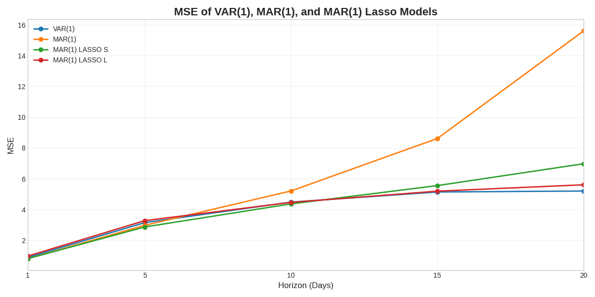
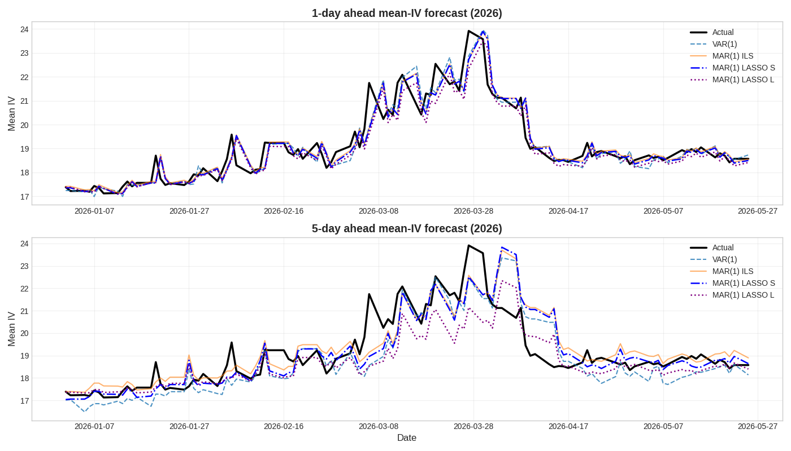
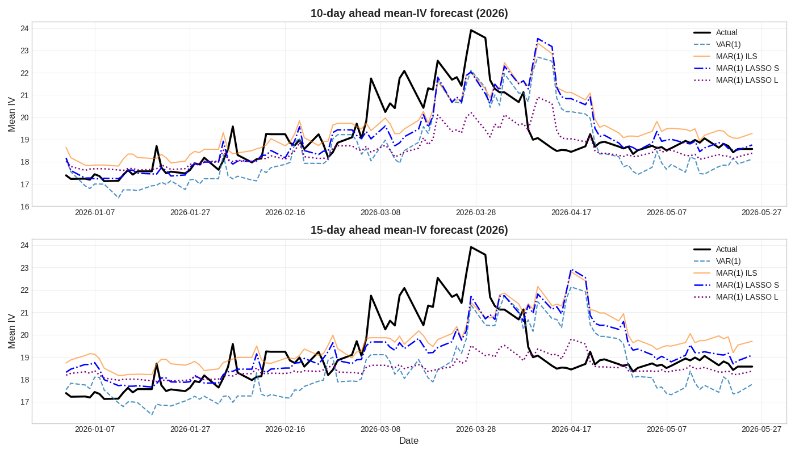
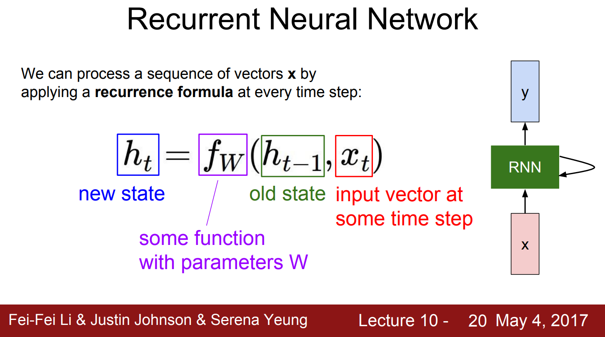
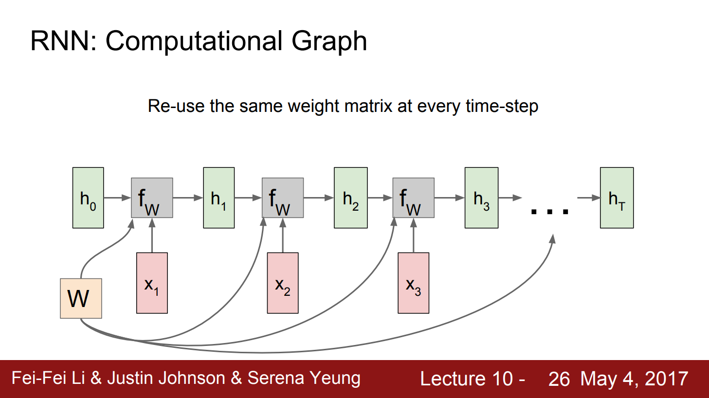
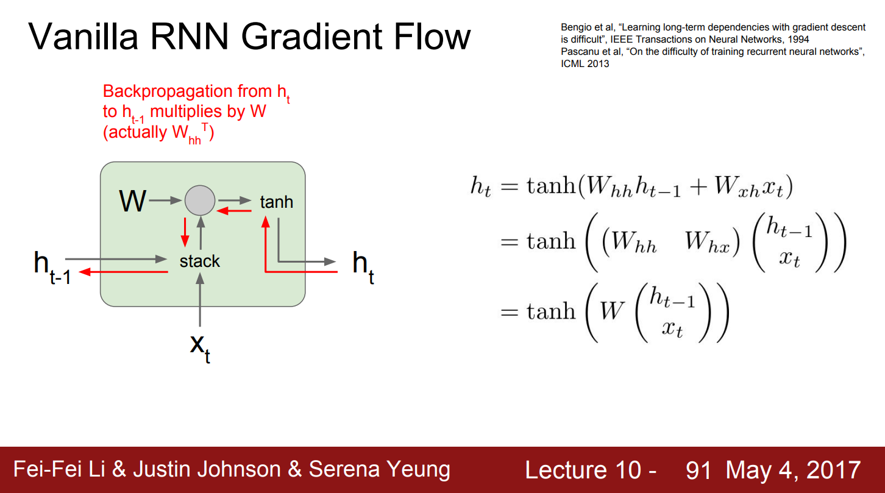
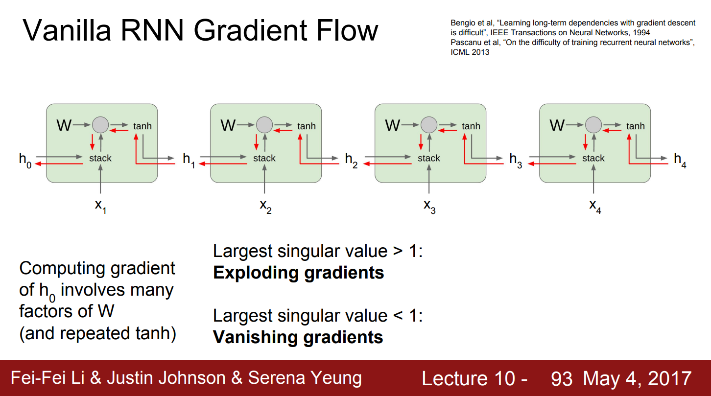
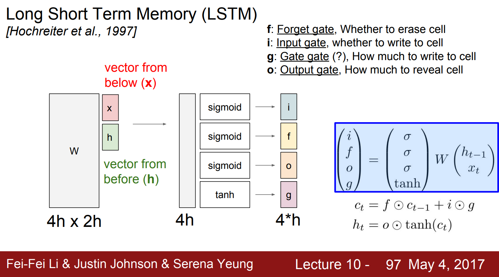
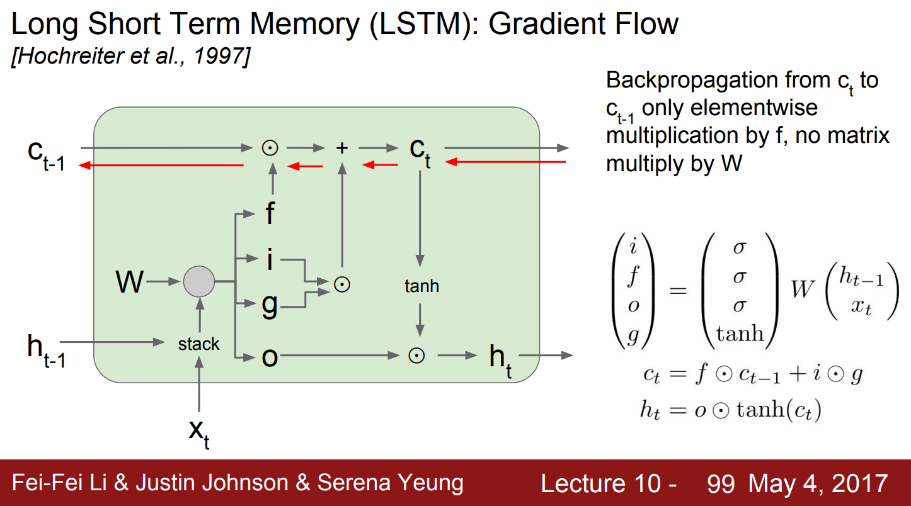
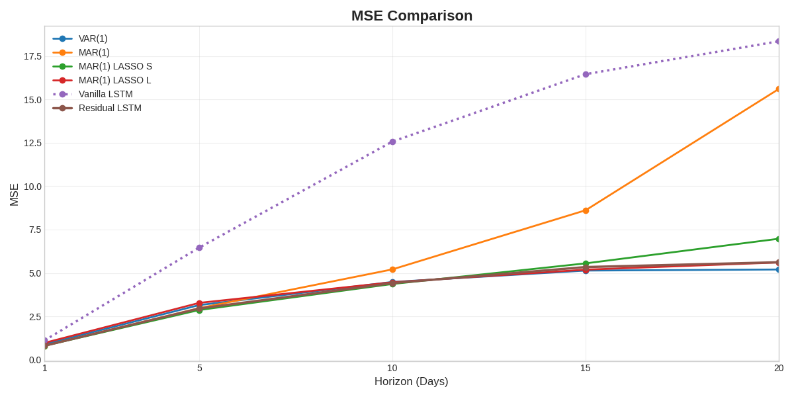

---

marp: true
theme: gaia
paginate: true
style: |
  section.table-slide {
    display: flex;
    flex-direction: column;
  }
  section.table-slide .table-middle {
    flex: 1;
    display: flex;
    align-items: center;
    justify-content: center;
  }
  section.table-slide .table-middle table {
    margin: 0;
  }
  section.table-slide .table-footnote {
    flex-shrink: 0;
    margin-top: 0.5em;
    font-size: 0.8em;
    text-align: left;
    opacity: 0.85;
  }
  section.image-slide {
    display: flex;
    flex-direction: column;
  }
  section.image-slide h2 {
    flex-shrink: 0;
    margin-bottom: 0;
  }
  section.image-slide .image-middle {
    flex: 1;
    display: flex;
    align-items: center;
    justify-content: center;
    width: 100%;
    min-height: 0;
  }
  section.image-slide .image-middle p {
    margin: 0;
    display: flex;
    align-items: center;
    justify-content: center;
    width: 100%;
    height: 100%;
  }
  section.image-slide .image-middle img {
    display: block;
    margin: 0 auto;
  }
  section.bs-slide .bs-legend {
    display: flex;
    justify-content: space-evenly;
    gap: 0.5rem;
    padding: 0 2rem;
  }
  section.bs-slide .bs-legend > div {
    flex: 0 1 auto;
    min-width: 8em;
  }

---

<!-- _class: lead -->
# Regularized MAR and LSTM
# in forecasting IV surfaces

---

### References

Jiang, H., Shen, B., Li, Y., & Gao, Z. (2024). Regularized estimation of high-dimensional matrix-variate autoregressive models

Chen, R., Xiao, H., & Yang, D. (2018). Autoregressive models for matrix-valued time series

Li, F.-F., Johnson, J., & Yeung, S. (2017). Lecture 10: Recurrent Neural Networks. CS231n: Convolutional Neural Networks for Visual Recognition (Spring 2017), Stanford University

---

### Options Pricing Overview

- Option: a financial instrument that gives the owner the right, but not the obligation, to buy/sell an underlying asset at a strike price
  - Strike price
  - Time to maturity

- Two types: call options (right to buy) and put options (right to sell)

- European-style options: can only be exercised at expiration

E.g. A European-style, $90, 30-day expiration, call option gives you the right to buy the underlying stock at $90 regardless of its market price at expiration

---

<!-- _class: bs-slide -->

### Black-Scholes's Model

$$
C = S_0 N(d_1) - K e^{-rT} N(d_2)
$$

$$
P = K e^{-rT} N(-d_2) - S_0N(-d_1)
$$

where

$$
d_1 = \frac{\ln(S_0/K) + (r + \tfrac{1}{2}\sigma^2)T}{\sigma\sqrt{T}},
\qquad
d_2 = d_1 - \sigma\sqrt{T}
$$

and

<div class="bs-legend">

<div>
S<sub></sub>: stock price <br>
K: strike price
</div>

<div>
r: risk-free interest rate <br>
T: time to maturity <br>
</div>

<div>
&sigma;: volatility
</div>

</div>

---

Assumptions:
1. The underlying stock does not pay a dividend and never will
2. The option must be European-style
3. Financial markets are efficient
4. No commissions are charged on the trade
5. Interest rates remain constant
6. The underlying stock returns are log-normally distributed

---

### Data Collection

<div style="display: flex; align-items: top; gap: 40px;">

  <div style="flex: 1;">
    <br>
    <strong>Source:</strong><br>Bloomberg<br>
    <strong>Time period:</strong><br>4/1/2016 - 5/25/2026<br>
    <strong>Moneyness (S/K):</strong><br>80%, 90%, 95%, 97.5%, 100%, 102.5%, 105%, 110%, 120%<br>
    <strong>Time to maturity:</strong><br>1M, 2M, 3M 6M, 12M, 18M, 24M<br>
    <i>Each IV surface is a 7x9 matrix</i>
  </div>

  <div style="flex: 1;">
    
  </div>

</div>

---

### Vector Autoregressive Model (VAR)

Let $X_t \in \mathbb{R}^{m \times n}$ represent the IV matrix at time $t$

VAR(1):

$$
\text{vec}(X_t) = \Phi\text{vec}(X_{t-1}) + e_t
$$

*where $vec(.)$ is the vectorization of a matrix by stacking its columns*

- Fail to capture relationship between rows and columns
- Number of parameters: $O(m^2n^2)$

---

### Matrix Autoregressive Model (MAR) <span style="font-weight: normal; font-size: 65%; font-style: italic;">(Chen et al., 2020)</span>

MAR(1):
$$
X_t = A X_{t-1} B^\top + E_t
$$

- Preserve the matrix structure
- Number of parameters: $O(m^2+n^2)$

Vectorized representation of MAR(1): 

$$\text{vec}(X_t) = (B \otimes A)\text{vec}(X_{t-1}) + \text{vec}(E_t)$$
*where $\otimes$ denotes the Kronecker product*

---

### MAR Estimation (1): Projection

Project an estimator of the VAR coefficient matrix, denoted as $\hat{\Phi}$, onto the space of Kronecker products under the Frobenius norm
  $$(\hat{A}_1, \hat{B}_1) = \arg\min_{A,B} \|\hat{\Phi} - B \otimes A\|_F^2$$
*An explicit solution exists, obtained through a singular value decomposition (SVD) of a re-arrangement version of ${\Phi}$ (Van Loan, 2000)* 

*The set of entries of $B \otimes A$ is the same as the set of entries of $\text{vec}(A)\text{vec}(B)'$*

---

Define a re-arrangement operator $\mathcal{G} : \mathbb{R}^{mn \times mn} \rightarrow \mathbb{R}^{m^2 \times n^2}$
$$
\mathcal{G}(B \otimes A) = \text{vec}(A)\text{vec}(B)'
$$

Given $\|\mathcal{G}(\boldsymbol{C})\|_F = \|\boldsymbol{C}\|_F$ and $\mathcal{G}$ is linear

$$
\begin{aligned}
\min_{\boldsymbol{A},\boldsymbol{B}} \|\hat{\Phi} - \boldsymbol{B} \otimes \boldsymbol{A}\|_F^2

&= \min_{\boldsymbol{A},\boldsymbol{B}} \|\mathcal{G}(\hat{\Phi}) - \mathcal{G}(\boldsymbol{B} \otimes \boldsymbol{A})\|_F^2

\\ &= \min_{\boldsymbol{A},\boldsymbol{B}} \|\mathcal{G}(\hat{\Phi}) - \text{vec}(\boldsymbol{A})\text{vec}(\boldsymbol{B})'\|_F^2 \\

&= \min_{\boldsymbol{A},\boldsymbol{B}} \|\tilde{\Phi} - \text{vec}(\boldsymbol{A})\text{vec}(\boldsymbol{B})'\|_F^2,
\end{aligned}
$$

*where $\tilde{\Phi} = \mathcal{G}(\hat{\Phi})$ is the re-arranged $\hat{\Phi}$*

---

Then,
$$
\text{vec}(\hat{\boldsymbol{A}})\text{vec}(\hat{\boldsymbol{B}})' = d_1 \boldsymbol{u}_1 \boldsymbol{v}_1',
$$

*where $d_1$ is the largest singular value of $\tilde{\Phi}$, and $u_1$, $v_1$ are the corresponding first left and right singular vectors*

By converting the vectors into matrices, we obtain the *projection estimators (PROJ)* of $A$ and $B$, denoted by $\hat{A}_1$ and $\hat{B}_1$, with the normalization that $\|\hat{A}_1\|_F = 1$

---

### MAR Estimation (2): Iterated least square

Assume entries of $E_t$ are i.i.d. with mean zero and constant variance:
  $$\min_{A,B} \sum_t \|X_t - A X_{t-1} B'\|_F^2$$

FOCs:
  $$\sum_t A X_{t-1} B' B X_{t-1}' - \sum_t X_t B X_{t-1}' = 0$$
  $$\sum_t B X_{t-1}' A' A X_{t-1} - \sum_t X_t' A X_{t-1} = 0$$

---

With probability one, the problem has a unique global minimum, and finitely many local minima

Using the $\hat{A}_1$ and $\hat{B}_1$ $(PROJ)$ as the starting values, iteratively update one matrix, $\hat{A}$ or $\hat{B}$, while fixing the other
  $$B \leftarrow \left(\sum_t X_t' A X_{t-1}\right) \left(\sum_t X_{t-1}' A' A X_{t-1}\right)^{-1}$$
  $$A \leftarrow \left(\sum_t X_t B X_{t-1}'\right) \left(\sum_t X_{t-1} B' B X_{t-1}'\right)^{-1}$$

to obtain $\hat{A}_2$ and $\hat{B}_2$, referred to as *LSE*

---

Split data: 80% old for train and 20% new for test
```
n_obs = len(Y_var)
split_idx = int(n_obs * 0.8)
Y_train, Y_test = Y_var.iloc[:split_idx], Y_var.iloc[split_idx:]
```
Fit VAR(1)
```
var1_model = VAR(Y_train)
var1_res = var1_model.fit(1)
```
- The coefficient matrix of VAR(1) is a 63x63 matrix (3969 parameters)

---

Fit VAR(p)
```
varp_model = VAR(Y_train)
varp_aic_res = varp_model.fit(maxlags=15, ic='aic') # p is selected by AIC
varp_bic_res = varp_model.fit(maxlags=15, ic='bic') # p is selected by BIC
```
- Optimal p selected by AIC: 15;
- Optimal p selected by BIC: 1
*BIC imposes a greater penalty on complexity*
$$\text{AIC} = \ln\left(\frac{\text{SSR}}{T}\right) + (p+1)\frac{2}{T},
\qquad
\text{BIC} = \ln\left(\frac{\text{SSR}}{T}\right) + (p+1)\frac{\ln(T)}{T}$$

Fit MAR(1): converged after 355 iterations where the Frobenius distances are less than $10^{-6}$

---

### Regularized MAR with LASSO <span style="font-weight: normal; font-size: 65%; font-style: italic;">(Jiang et al., 2024)</span>

Rewrite MAR into

$$
\text{vec}(Y_t) = ((B Y_{t-1}') \otimes I_m) \text{vec}(A) + \text{vec}(E_t)
$$
$$
\text{vec}(Y_t') = ((A Y_{t-1}) \otimes I_n) \text{vec}(B) + \text{vec}(E_t')
$$

Denote
$$
\begin{aligned}
Z_{t-1} &= (B Y_{t-1}') \otimes I_m, \quad \widehat{Z}_{t-1} = (\widehat{B} Y_{t-1}') \otimes I_m \\
Z_{t-1}^* &= (A Y_{t-1}) \otimes I_n, \quad \widehat{Z}_{t-1}^* = (\widehat{A} Y_{t-1}) \otimes I_n
\end{aligned}
$$

---

Using $\widehat{A}_2$ and $\widehat{B}_2$ $(LSE)$ as the starting values, iteratively solve the optimization to update one matrix, $\widehat{A}$ or $\widehat{B}$, while fixing the other
$$
\widehat{\alpha} = \arg\min_{\alpha \in \mathbb{R}^{m^2}} \left\{ \frac{1}{T} \sum_{t=2}^T \| \mathbf{y}_t - \widehat{\mathbf{Z}}_{t-1} \alpha \|_2^2 + \lambda_{1,T} \|\alpha\|_1 \right\} \tag{1}
$$

$$
\widehat{\beta} = \arg\min_{\beta \in \mathbb{R}^{n^2}} \left\{ \frac{1}{T} \sum_{t=2}^T \| \mathbf{y}_t^* - \widehat{\mathbf{Z}}_{t-1}^* \beta \|_2^2 + \lambda_{2,T} \|\beta\|_1 \right\} \tag{2}
$$


The estimated coefficients are consistent under the condition that $\max(m,n)mn/T \rightarrow 0$, and $A$ and $B$ have a finite number of non-zero entries

---

Fit MAR Lasso
- Use K-Fold Expanding Window CV to select $\lambda_{1,T}$ and $\lambda_{2,T}$
```
lambda_1 = np.logspace(-4, -1, 4) # 4 points between 1e-4 and 1e-1
lambda_2 = np.logspace(-4, -1, 4) # 4 points between 1e-4 and 1e-1
tscv = TimeSeriesSplit(n_splits=3) # 3 folds
```
$\lambda_{1,T}$ = 0.1, $\lambda_{2,T}$ = 0.001, Best MSE = 1.761308

```
lambda_1 = np.logspace(-5, 5, 10) # 10 points between 1e-5 and 1e5
lambda_2 = np.logspace(-5, 5, 10) # 10 points between 1e-5 and 1e5
tscv = TimeSeriesSplit(n_splits=5) # 5 folds
```
$\lambda_{1,T}$ = 3.59381, $\lambda_{2,T}$ = 0.00167, Best MSE = 1.704284

---  

<div>
<style scoped>
    /* Added CSS for table size and text size */
    .dataframe {
        width: 100%;           /* Adjusts the table width */
        max-width: 1500px;     /* Prevents the table from getting too wide */
        font-size: 30px;       /* Adjusts the text size */
    }
    
    /* Added padding so the text isn't cramped */
    .dataframe th, .dataframe td {
        padding: 8px 12px;
    }

    .dataframe tbody tr th:only-of-type {
        vertical-align: middle;
    }

    .dataframe tbody tr th {
        vertical-align: top;
    }

    .dataframe thead th {
        text-align: center;
    }
</style>
<table border="1" class="dataframe">
  <thead>
    <tr style="text-align: center;">
      <th>Horizon (days)</th>
      <th>VAR(1)</th>
      <th>VAR(15) AIC</th>
      <th>MAR(1)</th>
      <th>MAR(1) LASSO S</th>
      <th>MAR(1) LASSO L</th>
    </tr>
  </thead>
  <tbody>
    <tr>
      <td style="text-align: center;">1</td>
      <td style="text-align: right;">0.89</td>
      <td style="text-align: right;">2.45</td>
      <td style="text-align: right;">0.81</td>
      <td style="text-align: right;">0.81</td>
      <td style="text-align: right;">0.98</td>
    </tr>
    <tr>
      <td style="text-align: center;">5</td>
      <td style="text-align: right;">3.15</td>
      <td style="text-align: right;">7.93</td>
      <td style="text-align: right;">2.98</td>
      <td style="text-align: right;">2.87</td>
      <td style="text-align: right;">3.28</td>
    </tr>
    <tr>
      <td style="text-align: center;">10</td>
      <td style="text-align: right;">4.48</td>
      <td style="text-align: right;">9.95</td>
      <td style="text-align: right;">5.21</td>
      <td style="text-align: right;">4.37</td>
      <td style="text-align: right;">4.47</td>
    </tr>
    <tr>
      <td style="text-align: center;">15</td>
      <td style="text-align: right;">5.14</td>
      <td style="text-align: right;">10.43</td>
      <td style="text-align: right;">8.61</td>
      <td style="text-align: right;">5.55</td>
      <td style="text-align: right;">5.19</td>
    </tr>
    <tr>
      <td style="text-align: center;">20</td>
      <td style="text-align: right;">5.20</td>
      <td style="text-align: right;">9.95</td>
      <td style="text-align: right;">15.60</td>
      <td style="text-align: right;">6.97</td>
      <td style="text-align: right;">5.61</td>
    </tr>
    <tr>
      <td style="text-align: center;">25</td>
      <td style="text-align: right;">5.89</td>
      <td style="text-align: right;">10.20</td>
      <td style="text-align: right;">33.35</td>
      <td style="text-align: right;">9.68</td>
      <td style="text-align: right;">5.94</td>
    </tr>
    <tr>
      <td style="text-align: center;">30</td>
      <td style="text-align: right;">6.23</td>
      <td style="text-align: right;">10.77</td>
      <td style="text-align: right;">85.49</td>
      <td style="text-align: right;">13.67</td>
      <td style="text-align: right;">6.01</td>
    </tr>
    <tr>
      <td style="text-align: center;">60</td>
      <td style="text-align: right;">7.37</td>
      <td style="text-align: right;">13.72</td>
      <td style="text-align: right;">74965.18</td>
      <td style="text-align: right;">115.34</td>
      <td style="text-align: right;">5.67</td>
    </tr>
    <tr>
      <td style="text-align: center;">90</td>
      <td style="text-align: right;">6.64</td>
      <td style="text-align: right;">14.42</td>
      <td style="text-align: right;">1.37e8</td>
      <td style="text-align: right;">413.36</td>
      <td style="text-align: right;">5.66</td>
    </tr>
  </tbody>
</table>
</div>

---

<!-- _class: image-slide -->

<div class="image-middle">



</div>

---

<!-- _class: image-slide -->

<div class="image-middle">



</div>

<!-- 
Prediction is more accurate at capturing linear trends but fails to predict the changes
Looks like it gives late predictions
-->

---

<!-- _class: image-slide -->

<div class="image-middle">



</div>

---

*Obs: MAR(1) slightly outperformed VAR(1) for 1-day and 5-day horizons. As the horizon increases, while all the models got worse, MAR(1) completely exploded*

  - MAR iteratively solves local minimization problems, which more likely yields an eigenvalue greater than 1
  - Iterated multi-period forecast raises the eigenvalue to a power equal to the time horizon
  - Forecast compounds exponentially and thus MSFE explodes

---

*Obs: There is a positive correlation between the penalty magnitude and time horizon in terms of prediction performance*

- MAR(1) LASSO S with smaller penalties improved short-term forecasts but could not avoid long-term explosion
- MAR(1) LASSO L with larger penalties prevented long-term explosion but caused underfitting in the short term

---

*Obs: VAR(15) underperformed against all the first-lagged  models*

  - The Weak Efficient Market Hypothesis *(Eugene Fama, 1970)*: today’s stock prices reflect all the data of past prices and that no form of technical analysis can aid investors
  - The First Fundamental Theorem of Asset Pricing *(Harrison, Kreps, 1979)*: a financial market is arbitrage-free if and only if an Equivalent Martingale Measure exists under which the discounted price of all traded assets are martingales.
  - IV follows a random walk at least in the short term
  - A greater number of lags with no extra information but noise causes overfitting

---

<!-- _class: image-slide -->

<div class="image-middle">



</div>

---

<!-- _class: image-slide -->

<div class="image-middle">



</div>

---

<!-- _class: image-slide -->

<div class="image-middle">



</div>

---

<!-- _class: image-slide -->

<div class="image-middle">



</div>

---

<!-- _class: image-slide -->

<div class="image-middle">



</div>

---

<!-- _class: image-slide -->

<div class="image-middle">



</div>

---

### Vanilla LSTM vs. Residual LSTM

1. Predict $\Delta_{t}=y_{t}-y_{t-1}$ instead of $y_{t}$
- Vanilla LSTM: 
$$\hat{y}_{t} = W h_{t-1}$$
$$\mathcal{L} = || y_{t} - W h_{t-1} ||_F^2$$
- Residual LSTM: 
$$\hat{y}_{t} = y_{t-1} + Wh_{t-1}$$
$$\mathcal{L} = || (y_{t} - y_{t-1}) - W h_{t-1}||_F^2$$

---

### Residual LSTM

2. Reduce overfitting
  - Dropout 20%
  - Weight decay (L2 regularization), $\lambda=10^{-4}$
  - Reduce hidden state dimension from 64 to 32

3. Increase epochs: offset the effect of dropout and weight decay

---

<!-- _class: image-slide -->

<div class="image-middle">



</div>

---

*Obs:
Vanilla LSTM suffered from overfitting
Residual LSTM gave a similar result with MAR LASSO S for 1-day and 5-day horizon but remained more stable in the long run*

- Overall, Residual LSTM outperformed other models in forecasting IV
- However, predictions may not be comparable due to different response variables
- To extend the study, 
  - run econometric models  on $\Delta_{t}$ instead of $y_{t}$
  - implement ConvLSTM to preserve the matrix structure


